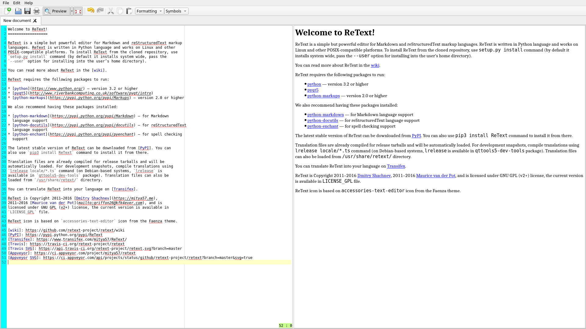

# retext-flatpak

**ReText** is a simple but powerful text editor for Markdown and reStructuredText.



[Homepage](https://github.com/retext-project/retext)

This repo is about the flatpak package.

## Instructions

### Requirements

* [flatpak](https://github.com/flatpak/flatpak)
* [flatpak-builder](https://github.com/flatpak/flatpak-builder)

For EL7:

```
# yum install 'flatpak' 'flatpak-builder'
```

You may also wish to install the `xdg-desktop-portal*` packages:

```
# yum install 'xdg-desktop-portal*'
```

See also:

* [flatpak setup](https://flatpak.org/setup)

### Adding repository

```
$ flatpak remote-add --if-not-exists "flathub" "https://dl.flathub.org/repo/flathub.flatpakrepo"
```

See also:

* [flathub setup](http://docs.flatpak.org/en/latest/using-flatpak.html#add-a-remote)

### Prepare

```
$ flatpak --user install "flathub" "org.kde.Sdk//5.12"
```

```
$ flatpak --user install "flathub" "org.kde.Platform//5.12"
```

Clone this repository, then checkout the right branch.

```
$ flatpak --user install "flathub" "io.qt.qtwebkit.BaseApp//5.12"
```

### Build

```
$ flatpak-builder "build" "me.mitya57.ReText.yaml" --force-clean --install-deps-from="flathub"
```

### Test

```
$ flatpak-builder --run "build" "me.mitya57.ReText.yaml" "sh"
```

### Create repo

```
$ flatpak-builder --repo="repo" --force-clean "build" "me.mitya57.ReText.yaml"
```

### Install

```
$ flatpak --user remote-add --no-gpg-verify "retext-kde5.12" "repo"
```

```
$ flatpak --user install "retext-kde5.12" "me.mitya57.ReText"
```

### Run

```
$ flatpak --user run "me.mitya57.ReText"
```

### Uninstall

```
$ flatpak --user uninstall "me.mitya57.ReText"
```

```
$ flatpak --user remote-delete "retext-kde5.12"
```

### Build single-file bundle

```
$ flatpak build-bundle "repo" "retext.flatpak" "me.mitya57.ReText" --runtime-repo="https://flathub.org/repo/flathub.flatpakrepo"
```

### Install single-file bundle

If you have already [installed](#install) the package, you have to [uninstall](#uninstall) it before continuing.

```
$ flatpak --user install "retext.flatpak"
```

See also:

* [Building your first Flatpak](http://docs.flatpak.org/en/latest/first-build.html)
* [Single-file bundles](http://docs.flatpak.org/en/latest/single-file-bundles.html#single-file-bundles)

## FAQ

### Does flatpak-ed ReText run as superuser?

[No](https://github.com/flatpak/flatpak/issues/1557). It is a [MATE](https://github.com/mate-desktop)/[marco](https://github.com/mate-desktop/marco) [issue](https://github.com/mate-desktop/marco/issues/301).

### Why not a RPM package?

This is not always possible. For example, for EL7:

* Main repo does not provide the **python3** package. However, there is a **python34** in EPEL7.
* System (main repo + EPEL) does not provide following packages: **python3-enchant**, **python3-docutils**, **python3-textile**, **python3-markups**. However, it is possible to rebuild them for EPEL7.
* System does not provide the **python3-qt5** package.
* **python3-qt5** package depends on **python3-sip** package. The **sip** package is available in EL7, but without **python3** support.
* **python-qt5** requires **sip** >= *4.18*, but EL7 provides only *4.14.6* version. The **sip** package in EL7 has not been updated since the system was released (in 2014).

Update: **python3** is now part of the main repo, and EPEL7 provides the **python36-qt5** package. Moreover, there is **python36-docutils** in EPEL7. However, you still have to provide **python3-enchant**, **python3-markups** and **python3-textile** on your own. But what's worse, **python36-markdown** from EPEL7 is too old to satisfy the program requirements.

### How to create module manifest for a PIP package?

You can use [Flatpak PIP Generator](https://github.com/flatpak/flatpak-builder-tools/tree/master/pip) from [Flatpak Builder Tools](https://github.com/flatpak/flatpak-builder-tools) repository.

Please remember to enable **rh-python36** on EL7.

```
scl enable rh-python36 bash
```

Update: **python3** is now part of the main repo.

### Are you the author of ReText?

No, I only created the flatpak package for it.

See also:

* [GitHub repo](https://github.com/retext-project/retext)

